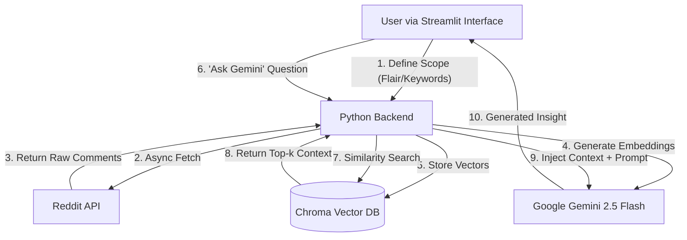

# Reddit Android Beta Feedback Analyzer 🤖📱

An intelligent, AI-powered tool designed to analyze user feedback, bug reports, and community sentiment regarding Android Beta versions directly from Reddit. By leveraging **Retrieval-Augmented Generation processes (RAG)**, this application transforms thousands of unstructured comments into actionable insights.


---

## 📖 Table of Contents
- [🧐 The Problem](#-the-problem)
- [💡 The Solution](#-the-solution)
- [⚙️ Technical Deep Dive](#-technical-deep-dive)
- [📂 Project Structure](#-project-structure)
- [🏗 Architecture](#-architecture)
- [🚀 Installation & Usage](#-installation--usage)
- [🔮 Future Scope](#-future-scope)
- [📝 License](#-license)
- [📬 Contact](#-contact)

---

## 🧐 The Problem

Developers and Product Managers often struggle to track user sentiment. For Android Beta releases, thousands of users flood subreddits like `r/android_beta` with critical feedback:
*   *"My battery drains twice as fast on QPR1!"*
*   *"The new lock screen widgets are broken."*
*   *"Pixel 7 overheats while charging."*

**The Challenge:** Manually reading through thousands of nested comments to find these patterns is impossible. There is too much noise and not enough signal.

---

## 💡 The Solution

This application automates the feedback loop. It acts as a **semantic search engine** for Reddit discussions.

Instead of searching for exact keywords (which misses context like "my phone gets hot" vs "overheating"), it uses **Vector Embeddings** to understand the *meaning* of comments. You can ask natural language questions like *"What are the main camera issues?"*, and the AI reads the relevant user comments to generate a summarized report.

---

## ⚙️ Technical Deep Dive

This project utilizes **RAG (Retrieval-Augmented Generation)** to ground the AI's answers in real data. Here is the step-by-step logic:

### 1. Data Ingestion (`asyncpraw`)
We use the Reddit API to fetch live discussion threads.
*   **Why Async?** Reddit threads can have thousands of comments. Using asynchronous Python allows us to network-fetch multiple comment trees in parallel, significantly speeding up data loading.

### 2. Chunking & Embeddings
We can't feed an entire subreddit into an LLM (it would be too expensive and exceed token limits).
*   **Chunking:** We split the text into chunks of 1000 characters.
*   **Embeddings:** We pass these chunks to Google's `text-embedding-004` model. This turns text into a list of numbers (vectors).
    *   *Example:* The vectors for "battery drain" and "bad autonomy" will be mathematically close to each other.

### 3. Vector Storage (`ChromaDB`)
These vectors are stored locally in ChromaDB. This allows us to perform "Similarity Search" efficiently.

### 4. Generation (`Gemini 2.5 Flash`)
When you ask a question:
1.  The system searches ChromaDB for the 5 chunks most relevant to your query.
2.  It creates a prompt: *"Here are 5 comments from users. Based ONLY on these, answer the question: [Your Question]"*.
3.  Gemini generates the answer, citing the sources.

---

## 📂 Project Structure

Here is how the codebase is organized to support this pipeline:

```bash
reddit-qa-app/
├── app.py                  # The Frontend (Streamlit). Handles UI, State, and limits API costs.
├── reddit_data_download.py # The Backend Logic. Handles Reddit API authentication & scraping.
├── requirements.txt        # List of dependencies (LangChain, Streamlit, etc.)
├── reddit_conda.yaml       # Environment config for Conda users.
├── data/                   # (Ignored by Git) Temporary storage for raw JSON data.
└── chroma_db/              # (Ignored by Git) The Local Vector Database storage.
```

---

## 🏗 Architecture

### System Architecture


---

## 🚀 Installation & Usage

### Prerequisites
- Python 3.10+
- A Google Cloud API Key (for Gemini)
- Reddit API Credentials (Client ID, Secret, User Agent)

### Steps
1.  **Clone the repository**:
    ```bash
    git clone https://github.com/rugveddarwhekar/reddit-qa-app.git
    cd reddit-qa-app
    ```

2.  **Install dependencies**:
    ```bash
    pip install -r requirements.txt
    ```

3.  **Set up environment variables**:
    Create a `.env` file in the root directory:
    ```env
    GOOGLE_API_KEY=your_google_key
    REDDIT_CLIENT_ID=your_reddit_id
    REDDIT_CLIENT_SECRET=your_reddit_secret
    ```

4.  **Run the app**:
    ```bash
    streamlit run app.py
    ```

---

## 🔮 Future Scope

The project is currently in Version 1.0. Future improvements include:
*   **Sentiment Analysis Dashboard**: Visual charts showing positive vs. negative sentiment trends over time.
*   **Multi-Subreddit Support**: Searching across multiple subreddits simultaneously (e.g., r/GooglePixel + r/android_beta).
*   **Cloud Database**: Migrating from local ChromaDB to Pinecone or Weaviate for persistent, scalable storage.

---

## 📝 License

**MIT License (Modified)**

This project is free to use, modify, and distribute for any purpose, provided that **proper credits are given to the original author**.

**Copyright (c) 2024 Rugved Darwhekar**

---

## 📬 Contact

Created by **Rugved Darwhekar**.

If you have questions, suggestions, or want to collaborate, feel free to reach out:
📧 **Email**: [darwhekarrugved@gmail.com](mailto:darwhekarrugved@gmail.com)