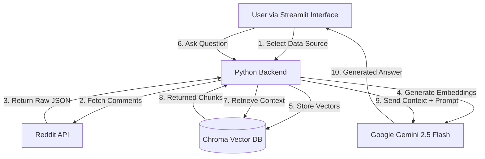
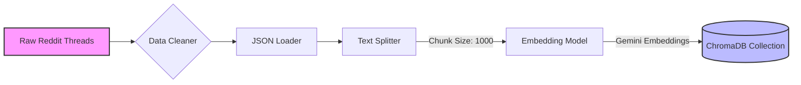
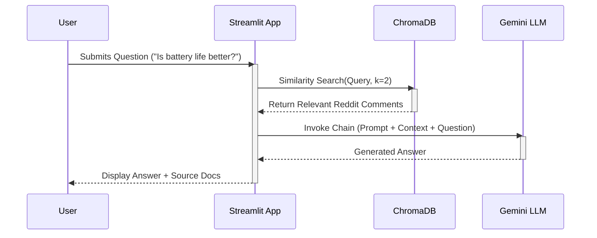

# Reddit Android Beta Feedback Analyzer 🤖📱

An intelligent, AI-powered tool designed to analyze user feedback, bug reports, and community sentiment regarding Android Beta versions directly from Reddit. By leveraging Retrieval Augmented Generation (RAG), this application transforms thousands of unstructured comments into actionable insights.


---

## 📖 Table of Contents
- [Overview](#-overview)
- [How It Works](#-how-it-works)
- [Architecture](#-architecture)
- [Installation & Usage](#-installation--usage)
- [Future Scope](#-future-scope)
- [License](#-license)
- [Contact](#-contact)

---

## 🔍 Overview

Tracking user feedback on Reddit threads can be overwhelming. Thousands of comments are posted about bugs, battery life, and new features in Android Beta releases. This application simplifies that process by:

1.  **Scraping** Reddit threads based on specific Flairs (e.g., "Android 15 QPR1"), URLs, or keywords.
2.  **Indexing** the comments into a vector database for semantic understanding.
3.  **Answering** natural language questions about the feedback using Google's Gemini 2.5 Flash model.

**Key Use Cases:**
- "What are the most common bugs in Android 16 DP2?"
- "Are users reporting battery drain on the latest beta?"
- "How is the new lock screen customization received?"

---

## ⚙️ How It Works

The application follows a simple but powerful pipeline:

1.  **Data Ingestion**: The app uses `asyncpraw` (Async Reddit API Wrapper) to fetch submissions and their nested comments. It handles pagination to ensure comprehensive data collection.
2.  **Preprocessing**: Raw JSON data is cleaned and split into manageable text chunks using `RecursiveCharacterTextSplitter`.
3.  **Vectorization**: Text chunks are converted into high-dimensional vectors using `GoogleGenerativeAIEmbeddings`.
4.  **Storage**: These vectors are stored locally in a `Chroma` vector database.
5.  **Retrieval & Generation**: When a user asks a question, the system finds the most relevant comments (semantic search) and feeds them as context to the Gemini LLM to generate a precise answer.

---

## 🏗 Architecture

### 1. High-Level System Architecture

This diagram illustrates the overall flow of data from the User to the AI response.



### 2. Data Processing Pipeline

A detailed look at how raw text becomes searchable intelligence.



### 3. User Interaction Sequence

The sequence of events during a live Q&A session.



---

## 🚀 Installation & Usage

### Prerequisites
- Python 3.10+
- A Google Cloud API Key (for Gemini)
- Reddit API Credentials (Client ID, Secret, User Agent)

### Steps
1.  **Clone the repository**:
    ```bash
    git clone https://github.com/rugveddarwhekar/reddit-qa-app.git
    cd reddit-qa-app
    ```

2.  **Install dependencies**:
    ```bash
    pip install -r requirements.txt
    ```

3.  **Set up environment variables**:
    Create a `.env` file in the root directory:
    ```env
    GOOGLE_API_KEY=your_google_key
    REDDIT_CLIENT_ID=your_reddit_id
    REDDIT_CLIENT_SECRET=your_reddit_secret
    ```

4.  **Run the app**:
    ```bash
    streamlit run app.py
    ```

---

## 🔮 Future Scope

The project is currently in Version 1.0. Future improvements include:
*   **Sentiment Analysis Dashboard**: Visual charts showing positive vs. negative sentiment trends over time.
*   **Multi-Subreddit Support**: Searching across multiple subreddits simultaneously (e.g., r/GooglePixel + r/android_beta).
*   **Automatic Summarization**: Generating weekly digests of top reported issues without user prompting.
*   **Cloud Database**: Migrating from local ChromaDB to Pinecone or Weaviate for persistent, scalable storage.

---

## 📝 License

**MIT License (Modified)**

This project is free to use, modify, and distribute. You are granted permission to use this software for any purpose, including commercial applications, provided that **proper credits are given to the original author**.

Permissions:
✅ Commercial use
✅ Modification
✅ Distribution
✅ Private use

Conditions:
ℹ️ License and copyright notice must be included.
ℹ️ **Credit must be given to Rugved Darwhekar in derived works.**

---

## 📬 Contact

Created by **Rugved Darwhekar**.

If you have questions, suggestions, or want to collaborate, feel free to reach out:
📧 **Email**: [darwhekarrugved@gmail.com](mailto:darwhekarrugved@gmail.com)